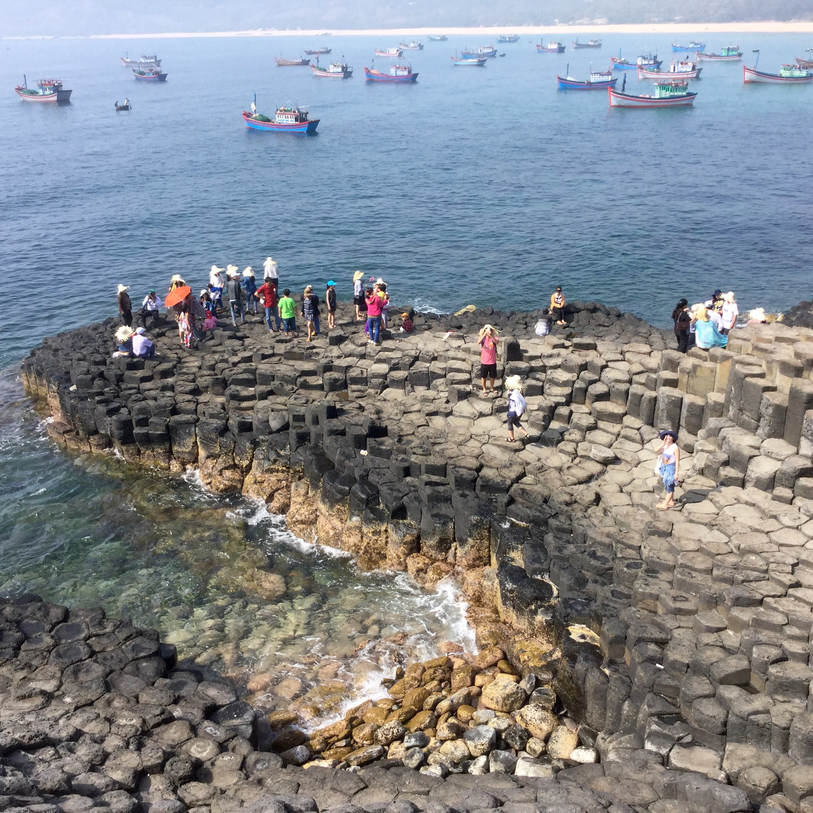
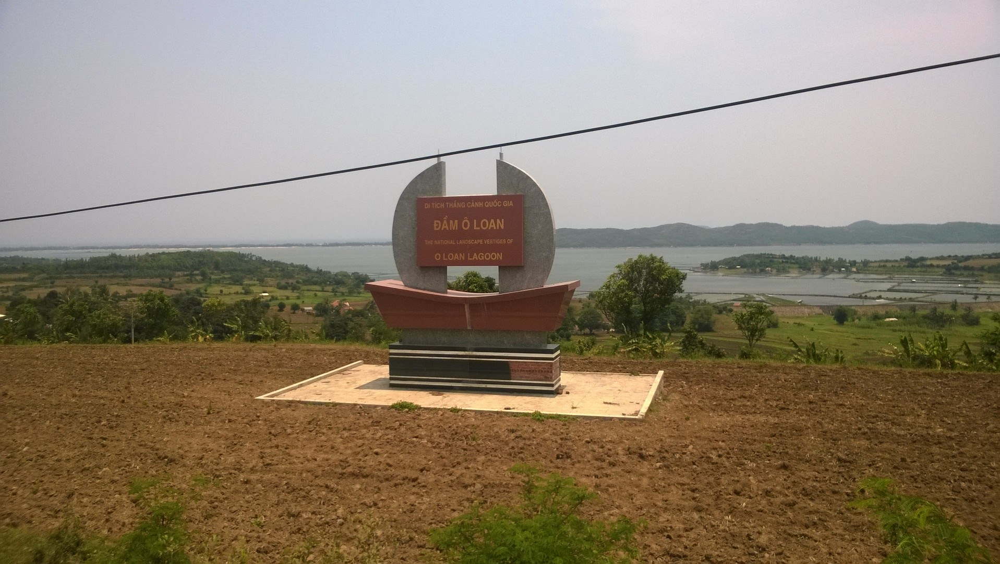
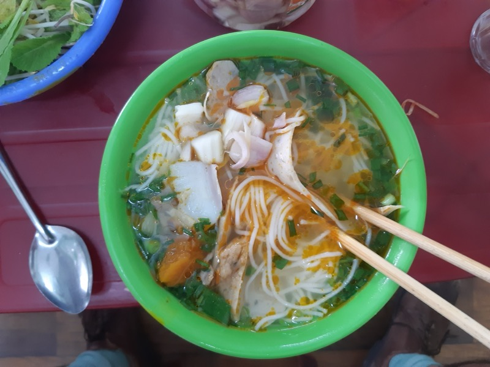
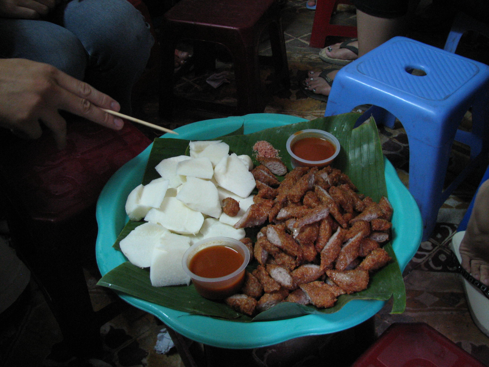
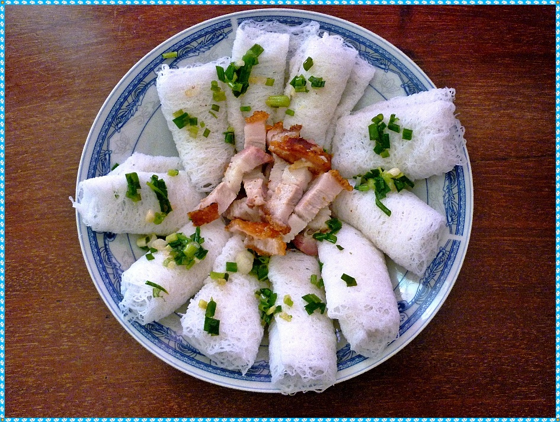
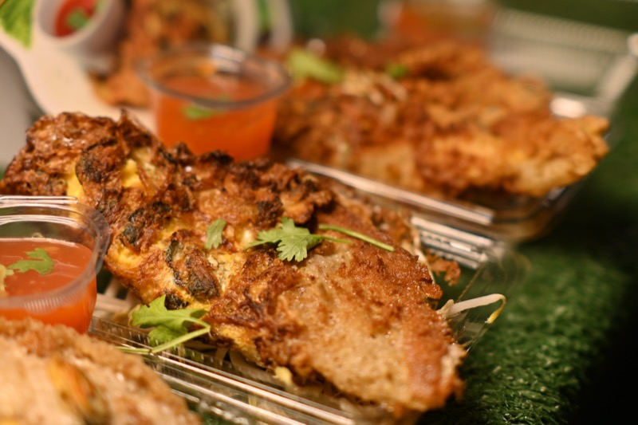
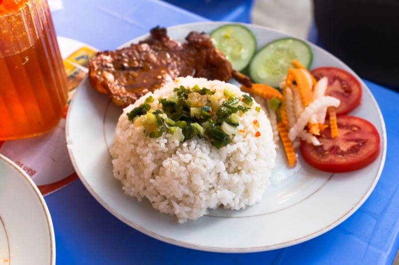

# 🇻🇳 2026년 5월 베트남 나트랑 여행 (철쏭)

**기간:** 2026년 5월 4일 (월) ~ 5월 10일 (일)  
**인원:** 남자 2명  
**경로:** 나트랑 → 뚜이호야 → 깜란

---

## 📋 목차

- [✈️ 항공편](#️-항공편)
- [🏨 숙소](#-숙소)
- [📅 일별 일정](#-일별-일정)
  - [5/4 (월) — 도착일](#54-월--도착일)
  - [5/5 (화) — 나트랑 자유일](#55-화--나트랑-자유일)
  - [5/6 (수) — 나트랑 체크아웃 → 뚜이호야 이동](#56-수--나트랑-체크아웃--뚜이호야-이동)
  - [5/7 (목) — 뚜이호야 자유일](#57-목--뚜이호야-자유일)
  - [5/8 (금) — 뚜이호야](#58-금--뚜이호야)
  - [5/9 (토) — 뚜이호야 → 깜란 리조트](#59-토--뚜이호야--깜란-리조트)
  - [5/10 (일) — 귀국](#510-일--귀국)
- [🍽️ 식당 목록](#️-식당-목록)
- [🎯 액티비티](#-액티비티)
- [🏍️ 바이크 렌탈 가이드 (뚜이호야)](#️-바이크-렌탈-가이드-뚜이호야)
- [🌤️ 날씨 정보](#️-날씨-정보)
- [💡 여행 팁](#-여행-팁)
- [🛒 기타](#-기타)

---

## ✈️ 항공편

> ⚠️ 항공편 일정은 변동될 수 있음 — 실시간 상태 확인: [trip.com VietJet 실황](https://kr.trip.com/flights/status/vj/)

| 구간 | 편명 | 날짜 | 시간 | 정보 링크 |
|------|------|------|------|----------|
| 김해(PUS) → 깜란(CXR) | VJ919 | 5/4 (월) | 10:55 ~ 13:35 | [VietJet 공식](https://www.vietjetair.com/ko) |
| 깜란(CXR) → 김해(PUS) | VJ918 | 5/10 (일) | 03:10 ~ 09:50 | [VietJet 공식](https://www.vietjetair.com/ko) |

---

## 🏨 숙소

| 기간 | 숙소 | 정보 링크 | 위치 링크 |
|------|------|-----------|-----------|
| 5/4~5/6 | Khách sạn VIRGO (나트랑) | | [지도](https://maps.app.goo.gl/CkUVsqwAZuJfa5jf6) |
| 5/6~5/9 | Rosa Alba Resort & Villa (뚜이호야) | [Agoda](https://www.agoda.com/ko-kr/rosa-alba-resort/hotel/tuy-hoa-phu-yen-vn.html) | [지도](https://www.google.com/maps/search/Rosa+Alba+Resort+Tuy+Hoa) |
| 5/9~5/10 | 디 엠피리언 깜란 비치 리조트 (The Empyrean Cam Ranh Beach Resort) | [Agoda](https://www.agoda.com/ko-kr/the-empyrean-cam-ranh-beach-resort/hotel/nha-trang-vn.html) | [지도](https://www.google.com/maps/search/The+Empyrean+Cam+Ranh+Beach+Resort) |

---

## 📅 일별 일정

### 5/4 (월) — 도착일

| 시간 | 일정 | 정보 링크 | 위치 링크 |
|------|------|-----------|-----------|
| 기내 | **아침** — 송대규 도시락 (기내 취식) | | |
| 10:55 | 김해 공항 출발 (VJ919) | | |
| 13:35 | 깜란 공항 도착 | | |
| 14:00~15:00 | 깜란 공항 → 나트랑 시내 이동 (그랩) | [Grab 앱](https://play.google.com/store/apps/details?id=com.grabtaxi.passenger) | |
| 점심 | 나트랑 시내 도착 후 바로 현지식 점심 | | [검색](https://www.google.com/maps/search/음식점+나트랑+시내) |
| 오후 | **Maryana Queen Spa** — 레게머리(헤어 블레이즈) | [네이버 블로그](https://m.blog.naver.com/PostView.naver?blogId=mandoo1983&logNo=223365956278) | [지도](https://www.google.com/maps/search/Maryana+Queen+Spa+Nha+Trang) |
| 저녁 | 닭날개 바베큐 | | |
| 밤 | 휴식 | | |

---

### 5/5 (화) — 나트랑 자유일

| 시간 | 일정 | 정보 링크 | 위치 링크 |
|------|------|-----------|-----------|
| 10:00 | 식사 — **바 또이** | | [지도](https://maps.app.goo.gl/Vc1izonekKXqphZ57) |
| 점심 | **포나가르 유적지** 방문 | | [지도](https://maps.app.goo.gl/x7G6dBRxsBqr6LQo8) |
| 오후 | **Museum of Oceanography** — 해양박물관 관람 | [공식 사이트](http://www.vnio.org.vn) | [지도](https://www.google.com/maps/search/Museum+of+Oceanography+Nha+Trang) |
| 오후 (박물관 후) | 당근주스 한 잔 | | |
| 오후 식사 | 박물관 주변 현지 해산물 식사 | | |
| 15:00~16:30 | 호텔 수영장에서 수영 | | |
| 저녁 | 우렁이 대나무 찜, 피자와 맥주 | | |
| 저녁 2차 | 베트남 김밥천국 식사 | | |

---

### 5/6 (수) — 나트랑 체크아웃 → 뚜이호야 이동

| 시간 | 일정 | 정보 링크 | 위치 링크 |
|------|------|-----------|-----------|
| 09:00~09:40 | 뚝배기 쌀국수 (아침) | | |
| 10:00 | 숙소 체크아웃 (Khách sạn VIRGO) | | |
| 10:30~13:30 | 나트랑 → 뚜이호야 이동 (리무진 버스, 약 3시간) | | |
| 14:00 | Rosa Alba Resort 체크인 | [Agoda](https://www.agoda.com/ko-kr/rosa-alba-resort/hotel/tuy-hoa-phu-yen-vn.html) | [지도](https://www.google.com/maps/search/Rosa+Alba+Resort+Tuy+Hoa) |
| 14:20~15:00 | Tuy Hoa 마켓 구경, 간식(토하) 등 | | |
| 15:00~15:30 | 현지 식사 (돼지고기 수육, 샐러드, 새우 스프) | | |
| 15:45~16:15 | Co.opmart Tuy Hòa 장보기 | | [지도](https://maps.app.goo.gl/Sw9GhPzZth2cn4KG6) |
| 16:30 | 숙소 귀환 | | |
| 16:45~17:45 | Tuy Hoa 비치에서 수영 | | |
| 19:00~20:30 | 해산물 가게 (1차) | | |
| 20:45~22:00 | 소금개미, 돼지고기구이 졸맛탱 가게 (2차) | | |

---

### 5/7 (목) — 뚜이호야 자유일


*가잉다디아의 육각형 현무암 절벽*


*오로안 석호 풍경*

| 시간 | 일정 | 정보 링크 | 위치 링크 |
|------|------|-----------|-----------|
| 08:30 | 호텔 조식 | | |
| 13:00~13:40 | Tuy Hoa Nghinh Phong Tower 구경 | | |
| 14:00~14:30 | 신성한 물고기, 볶음밥 먹방 | | |
| 15:30 | 전기 스쿠터 렌탈 | | |
| 15:30~18:30 | Tuy Hoa 시내 → Ganh Da Dia 부릉부릉 | | [지도](https://www.google.com/maps/place/Gành+Đá+Đĩa,+An+Ninh+Đông,+Tuy+An,+Phú+Yên) |
| 18:45~20:00 | 호텔 복귀 | | |
| 20:30~22:00 | 마사지 & 스파 | | |
| 22:30~23:45 | 돼지연골양념구이, 밥튀김 맛집에서 맥주 | | |

---

### 5/8 (금) — 뚜이호야

| 시간 | 일정 | 정보 링크 | 위치 링크 |
|------|------|-----------|-----------|
| 09:00 | 호텔 조식 | | |
| 12:00 | Tuy Hoa 마켓 재방문 | | |
| 13:00~13:45 | Cherry Coffee에서 과일주스 | | |
| 14:00~18:00 | 리조트에서 휴식 (멜론 먹음) | | |
| 18:30 | 오징어전이랑 맥주 | | |
| 19:00~19:50 | 로컬 거리 돌아다님 (술집, 카페, 피씨방 구경) | | |
| 20:00~21:00 | 베트남 닭 훠거 요리, 맥주 | | |

---

### 5/9 (토) — 뚜이호야 → 깜란 리조트

| 시간 | 일정 | 정보 링크 | 위치 링크 |
|------|------|-----------|-----------|
| 10:20 | Rosa Alba Resort 체크아웃 | | |
| 10:30~13:30 | 나트랑 시내 이동 | | |
| 15:30~16:30 | 쩐가죠 닭발구이 대박맛집 | | [지도](https://maps.app.goo.gl/vuNEUk4ypSqev7w67) |
| 18:00 | 디 엠피리언 깜란 비치 리조트 체크인 | [Agoda](https://www.agoda.com/ko-kr/the-empyrean-cam-ranh-beach-resort/hotel/nha-trang-vn.html) | [지도](https://www.google.com/maps/search/The+Empyrean+Cam+Ranh+Beach+Resort) |
| 20:00~22:00 | **쏭슐랭 디너** — Thuy Nguyen Seafood Restaurant | | [지도](https://maps.app.goo.gl/JH4yQ46SFAdpqNSm9) |

---

### 5/10 (일) — 귀국

| 시간 | 일정 |
|------|------|
| 01:00 | 리조트 체크아웃 |
| 01:00~01:10 | 리조트 → 깜란 공항 이동 |
| 01:10 | 깜란 공항 도착 (출발 2시간 전 도착 목표) |
| 03:10 | 깜란 공항 출발 |
| 09:50 | 김해 공항 도착 |

---

## 🍽️ 식당 목록

### 나트랑

| 이름 | 종류 | 정보 링크 | 위치 링크 | 메모 |
|------|------|-----------|-----------|------|
| Louisiane Brewhouse | 바/맥주 | [공식 사이트](https://louisianebrewhouse.com.vn/) | [지도](https://www.google.com/maps/search/Louisiane+Brewhouse+Nha+Trang) | 해변 야외석, 자체 양조 맥주 |
| Skylight | 루프탑 바 | | [지도](https://www.google.com/maps/search/Skylight+bar+Nha+Trang) | 야경 좋음, Havana Hotel 38F |
| (항구 근처 해산물 식당) | 해산물 | | [검색](https://www.google.com/maps/search/해산물+나트랑+항구) | 무게로 주문 |
| 분짜까 로컬 식당 | 로컬 면요리 | | [검색](https://www.google.com/maps/search/Bún+chả+cá+Nha+Trang) | 나트랑 대표 메뉴. 아침/점심 우선 추천 |
| 넴느엉 로컬 식당 | 로컬 고기요리 | | [검색](https://www.google.com/maps/search/Nem+nướng+Ninh+Hòa+Nha+Trang) | 실패 확률 낮은 나트랑 대표 메뉴 |

| | |
|---|---|
|  |  |
| **분짜까 (Bún chả cá)** — 생선·어묵이 실한 쌀국수 / 📍 *분짜까 로컬 식당 ([검색](https://www.google.com/maps/search/Bún+chả+cá+Nha+Trang))* | **넴쭈아느엉 (Nem chua nướng)** — 발효 돼지고기 구이, 달콤한 칠리 소스 / 📍 *넴느엉 로컬 식당 ([검색](https://www.google.com/maps/search/Nem+nướng+Ninh+Hòa+Nha+Trang))* |

### 뚜이호야

| 이름 | 종류 | 정보 링크 | 위치 링크 | 메모 |
|------|------|-----------|-----------|------|
| 반호이 롱헤오 로컬 식당 | 로컬 식사 | | [검색](https://www.google.com/maps/search/Bánh+hỏi+lòng+heo+Tuy+Hòa) | 뚜이호야 대표 메뉴, 우선순위 높음 |
| 참치 회/참치 구이 전문점 | 해산물 | | [검색](https://www.google.com/maps/search/cá+ngừ+đại+dương+Tuy+Hòa) | 푸옌 대표 먹거리, 최우선 후보 |
| Bi Cá Câu | 해산물 | | [지도](https://maps.app.goo.gl/wqsZxQKGFGcrjWdi7) | 맛있어 보이는데 멀다고 함 |
| Nhà Hàng Biển Xanh | 해산물 | | [지도](https://maps.app.goo.gl/6bqTheux2DJ2FSxm9) | 호텔 근처, 감성 있는 가게 |
| Hải sản Năm Ánh Phú Yên | 해산물 | | [지도](https://maps.app.goo.gl/ThSab7GakH19GSmW8) | 위 가게 바로 옆집 |
| Quán Hoa Sữa (Hải sản) | 해산물 | | [지도](https://maps.app.goo.gl/cx1FhmCwT6wQsHxs8) | 좋아보임 |
| Com Lua Moi 2 | 쏭슐랭 디너 | | [지도](https://www.google.com/maps/search/Cơm+Lúa+Mới+2+Tuy+Hoa) | 영업시간 09:00~21:00 주의. xứ Nẫu 향토 음식 |

| | |
|---|---|
|  |  |
| **반호이 롱헤오 (Bánh hỏi thịt quay)** — 얇은 쌀면+바삭한 구운 돼지고기 / 📍 *반호이 롱헤오 로컬 식당 ([검색](https://www.google.com/maps/search/Bánh+hỏi+lòng+heo+Tuy+Hòa))* | **해산물 구이 스틱** — 신선한 새우 구이 + 라임 칠리 소스 / 📍 *Nhà Hàng Biển Xanh ([지도](https://maps.app.goo.gl/6bqTheux2DJ2FSxm9)) · Hải sản Năm Ánh ([지도](https://maps.app.goo.gl/ThSab7GakH19GSmW8))* |

### 깜란

| 이름 | 종류 | 정보 링크 | 위치 링크 | 메모 |
|------|------|-----------|-----------|------|
| Thuy Nguyen Seafood Restaurant | 쏭슐랭 디너 | | [지도](https://maps.app.goo.gl/JH4yQ46SFAdpqNSm9) | Cam Hải Đông, Cam Lâm |
| 깜란 해산물 로컬 식당 | 해산물 | | [검색](https://www.google.com/maps/search/hải+sản+Cam+Ranh) | 마지막 날 대체 후보 |

| | |
|---|---|
|  | |
| **쌀 요리 (Cơm tấm 계열)** — 바삭한 돼지갈비 덮밥 / 📍 *Com Lua Moi 2 ([지도](https://www.google.com/maps/search/Cơm+Lúa+Mới+2+Cam+Ranh)) — 영업 09:00~21:00* | |


---

## 🎯 액티비티

| 이름 | 지역 | 정보 링크 | 위치 링크 | 메모 |
|------|------|-----------|-----------|------|
| 4 Island Tour | 나트랑 | [Klook 예약](https://www.klook.com/ko/activity/3053-4-island-boat-tour-nha-trang/) | | 08:00 출발, 스노클링+낚시+해상 바 |
| Thap Ba 머드 스파 | 나트랑 | [공식 사이트](https://thapba.com.vn/) | [지도](https://www.google.com/maps/search/Thap+Ba+Hot+Spring+Nha+Trang) | 예약 없이 가도 됨 |
| Maryana Queen Spa (레게머리) | 나트랑 | [네이버 블로그](https://m.blog.naver.com/PostView.naver?blogId=mandoo1983&logNo=223365956278) | [지도](https://www.google.com/maps/search/Maryana+Queen+Spa+Nha+Trang) | 콩카페 근처. 영업 09:00~자정. 헤어 블레이즈 40,000동/가닥, 발마사지 180,000동 |
| 모터바이크 렌트 | 뚜이호야 | | [검색](https://www.google.com/maps/search/motorbike+rental+Tuy+Hoa) | 국제면허 필요 |
| 무이디엔 등대 | 뚜이호야 | [Tripadvisor](https://www.tripadvisor.com/Attraction_Review-g12616068-d11641766-Reviews-Mui_Dien_Lighthouse-Hoa_Tam_Dak_Lak_Province.html) | [지도](https://www.google.com/maps/place/Mũi+Điện,+Đông+Hòa,+Phú+Yên) | 입장료 20,000 VND. 일출 보려면 04:30 출발 |
| 가잉다디아 | 뚜이호야 | [Wikipedia](https://en.wikipedia.org/wiki/Ganh_Da_Dia) | [지도](https://www.google.com/maps/place/Gành+Đá+Đĩa,+An+Ninh+Đông,+Tuy+An,+Phú+Yên) | 시내에서 35km |
| 붕로 만 | 뚜이호야 | | [지도](https://www.google.com/maps/place/Vũng+Rô,+Hòa+Xuân+Nam,+Đông+Hòa,+Phú+Yên) | 스노클링 가능 |
| 오로안 석호 | 뚜이호야 | | [지도](https://www.google.com/maps/place/Đầm+Ô+Loan,+An+Cư,+Tuy+An,+Phú+Yên) | 배 타고 해산물 직접 잡아먹기 |

---

## 🛒 기타

| 이름 | 종류 | 정보 링크 | 위치 링크 | 메모 |
|------|------|-----------|-----------|------|
| Co.opmart Tuy Hòa | 마트 | | [지도](https://maps.app.goo.gl/Sw9GhPzZth2cn4KG6) | 뚜이호야 장보기 |

---

## 🏍️ 바이크 렌탈 가이드 (뚜이호야)

> 대상 일정: **5/7 (목) — 자유일** (모터바이크 렌트 & 해안도로 드라이브)

### 💰 렌탈 가격

| 구분 | 가격 (VND) | 가격 (원화) |
|------|-----------|------------|
| 50cc 이하 (하루) | 120,000 ~ 150,000 VND | 약 6,000 ~ 7,500원 |
| 125cc 이하 (하루) | 150,000 ~ 200,000 VND | 약 7,500 ~ 10,000원 |
| **2대 기준 예상** | **약 300,000 VND** | **약 15,000원** |

### 📍 어디서 빌릴까

| 방법 | 설명 | 추천도 |
|------|------|--------|
| **Rosa Alba 숙소 프런트** | 가장 간단. 호텔에서 직접 연결 or 보유. 바가지 위험 낮음 | ⭐⭐⭐ |
| **시내 로컬 렌트샵** | Hung Vuong 거리 일대. 현금 흥정 가능 | [구글맵 검색](https://www.google.com/maps/search/motorbike+rental+Tuy+Hoa) |
| **Grab 앱 Rent 메뉴** | 실시간 가격 확인, 언어 장벽 없음 | [Grab 앱](https://play.google.com/store/apps/details?id=com.grabtaxi.passenger) |

### ⚠️ 면허 & 주의사항

| 항목 | 내용 |
|------|------|
| **50cc 이하** | 베트남 법상 면허 불필요 → **이걸로 빌리면 가장 깔끔** |
| 50cc 초과 | 국제운전면허증 (2륜 인증) 필요 — 한국 2종 소형 면허 있어야 발급 가능 |
| 무면허 적발 시 | 벌금 100만 ~ 200만 VND (소도시는 단속 드문 편) |
| 헬멧 | **필수** — 렌트샵에서 요청하면 제공 |
| 여권 | 원본 제출 금지 → **여권 사본 + 현금 보증금**으로 대체 요청 |
| 렌트 전 | 바이크 외관 사진 촬영 필수 (반납 시 분쟁 방지) |

### 🗺️ 추천 바이크 코스 (하루)

```
Rosa Alba Resort 출발
    ↓ 해안도로 북쪽으로 달리기 (~20분)
롱투이 비치 (Long Thuy Beach) — 조용한 해변, 사진 스팟
    ↓ (~20분)
가잉다디아 (Ghềnh Đá Đĩa) — 육각형 현무암 절벽 ★★★  [지도](https://www.google.com/maps/place/Gành+Đá+Đĩa,+An+Ninh+Đông,+Tuy+An,+Phú+Yên)
    ↓ 점심 (현지 식당)
무이디엔 등대 (Mũi Điện) — 절벽 위 등대, 해안 전망  [지도](https://www.google.com/maps/place/Mũi+Điện,+Đông+Hòa,+Phú+Yên)
    ↓ (~30분)
오로안 석호 or 붕로 만 — 스노클링 가능
    ↓
Rosa Alba 복귀 (17:30 목표)
```

| 명소 | 거리 (Rosa Alba 기준) | 특징 |
|------|--------------------|------|
| 롱투이 비치 | ~15km, 20분 | 조용한 해변, 스노클링 |
| 가잉다디아 | ~35km, 40분 | 육각형 현무암 절벽, 세계 10대 절경 |
| 무이디엔 등대 | ~20km, 30분 | 베트남 최동단, 일출 성지 (일출 보려면 04:30 출발) |
| 오로안 석호 | ~20km | 배 타고 해산물 직접 잡아먹기 |
| 붕로 만 | ~20km 남쪽 | 스노클링 |

### 📋 체크리스트

- [ ] 전날 숙소 프런트에서 바이크 2대 예약
- [ ] 여권 사본 준비 (원본 제출 금지)
- [ ] 렌트 전 바이크 외관 사진 촬영
- [ ] 헬멧 착용 확인
- [ ] 현금 VND 준비 (주유, 입장료)
- [ ] 구글맵 오프라인 지도 미리 다운로드

---

## 🌤️ 날씨 정보

> 📊 **5개년 평균 (2020~2025년 5월 기준)** — Open-Meteo 히스토리컬 데이터 기반

| 지역 | 평균 최고 | 평균 최저 | 월 강수량 | 특성 |
|------|----------|----------|----------|------|
| 나트랑 (Nha Trang) | 32°C | 26°C | ~85mm | 건기 막바지, 햇빛 강함 ☀️ |
| 뚜이호야 (Tuy Hoa) | 32°C | 26°C | ~93mm | 간헐적 소나기 가능, 대체로 맑음 |
| 깜란 (Cam Ranh) | 32°C | 26°C | ~82mm | 나트랑과 비슷, 건조함 |

### 5월 날씨 요약

- **전반적으로 맑고 더운 날씨** — 기온 25~32°C, 자외선 지수 높음
- **나트랑·깜란:** 5월은 건기 끝자락, 비 드물고 맑은 날 많음 🏖️
- **뚜이호야 (푸옌):** 5월~8월 소나기 시즌 시작, 주로 오후 짧은 소나기
- **체감온도:** 습도 60~80% — 실제로는 더 덥게 느껴짐
- **바람:** 남~남서풍 (스노클링/섬 투어에는 영향 없는 수준)

### 주의사항

- ☀️ **자외선 강함** — 썬크림 SPF50+ 필수, 10:00~15:00 강한 햇빛
- 🌧️ **오후 소나기** — 특히 뚜이호야 구간(5/6~5/9), 빠른 소나기 후 갬
- 💧 **수분 보충** 중요 — 하루 2L 이상 권장
- 🌊 **바다 컨디션** — 5월 나트랑 파도 안정적, 섬 투어 최적 시즌

---

## 💡 여행 팁

- **그랩(Grab)** 앱 미리 설치 — 택시 걱정 없음
- 소규모 식당은 카드 안 되는 곳 많음 — **현금(VND)** 충분히 준비
- 모터바이크 렌트 시 **국제면허** 필요 (없으면 리스크)
- 섬 투어/다이빙은 **전날 예약** 권장
- 5월은 날씨 좋음 (나트랑 우기 아님) — **썬크림** 필수 ☀️

---

